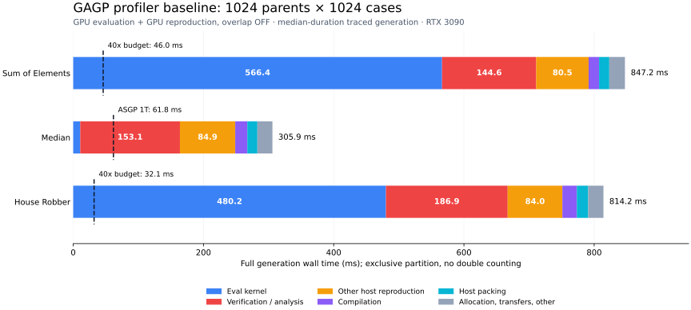

# 1024 × 1024 profiler baseline — 2026-10-01

本輪建立 profiler baseline 並提出優化方案，**未實作性能優化，也未修改 production C++ source**。NVTX 標記只加入 ignored `logs/profiler-baseline-20261001/source/cpp/` 的獨立副本。使用 Nsight Systems 2024.5.1；沒有使用 ncu。使用者所稱 medium 按既有題目 Median 解讀。

量測沿用 [fixed-asgp-v1](../../../docs/guides/fixed-asgp-benchmark.md)：每題 1024 個固定父代、1024 cases，每個 process 暖機一次、三次正式量測；完整 eval + selection + reproduction，不計初始 admission、case/session 初始化與 offline translation。每次仍產生下一代；没有 fitness 重用、減少 cases 或篩選父代。

RTX 3090（82 SM）、i9-10900K、CUDA 12.6、Release、blocksize 512、GPU 0。原始 source 以 commit `02aec6f` 加當前未提交 fixed BM 為基底，完整 source/binary/input hashes 保留。九組 GPU cells 各執行 original binary、NVTX binary 無 profiler、NVTX binary 有 profiler；ASGP 1T 另重新量測。所有非 timing JSON 欄位（fitness、variation counters 等）逐 repetition 相同。

## 未開 profiler 的對照結果

本表為三次正式 generation 的中位數，單位 ms；這是新的控制組量測，與較早 daily baseline 有自然波動。GPU eval 使用 CPU reproduction。

| 題目 | ASGP 1T | GPU eval | GPU repro off | GPU repro on | 最佳對 ASGP | 40× 時間上限 |
| --- | ---: | ---: | ---: | ---: | ---: | ---: |
| Sum of Elements | 1841.160 | 1393.091 | 834.317 | 805.996 | 2.284× | 46.029 |
| Median | 61.777 | 913.611 | 290.139 | 265.242 | 0.233× | 不要求同一目標 |
| House Robber | 1282.012 | 1466.383 | 791.796 | 761.333 | 1.684× | 32.050 |

## 可加總的時間歸因

以下使用 **GPU eval + GPU repro，overlap off**。每題選擇三次 trace 中 generation 時間居中的那一個樣本，再拆它的完整時間；不是把不同樣本的各階段中位數相加。單位 ms，所有列互斥、加總等於該 generation。

CPU 以 NVTX scope 的 wall duration 歸因；device 以 CUDA activity 起訖時間歸因。CUDA activity 優先於同時發生的 host CUDA API；API 再優先於最內層的 main-thread NVTX scope。因此 kernel 與等待它的 sync 不會重複計時。Worker thread 的時間總和另存，沒有當成 generation wall time。

| 階段 | Sum | Median | House Robber |
| --- | ---: | ---: | ---: |
| Compile（完整 compile_population，含內建檢查） | 16.068 | 18.614 | 22.258 |
| Host packing，扣除下列 bytecode verification | 15.678 | 15.428 | 17.371 |
| H2D：實際 device copy | 4.074 | 3.899 | 3.977 |
| Eval kernel：實際 device execution | 566.394 | 10.796 | 480.240 |
| Selection：host ranking + GPU tournament | 1.264 | 1.505 | 1.112 |
| Repro：其他 host 工作，含 donor/preprocess、decode 殘餘及清理 | 80.486 | 84.891 | 84.012 |
| Repro：GPU crossover/mutation、copyback compaction kernels | 0.954 | 0.865 | 0.891 |
| D2H：實際 device copy | 0.188 | 0.208 | 0.280 |
| Verification / analysis：詳細範圍見下表 | 144.589 | 153.087 | 186.915 |
| Sync：扣掉與 device activity 重疊後的 API 等待 | 0.081 | 0.136 | 0.092 |
| Allocation / setup：含 pinned staging 重新配置 | 13.663 | 13.089 | 13.485 |
| 其他：host transfer/launch、payload retain、eval bookkeeping | 3.791 | 3.403 | 3.608 |
| **完整 generation（有 profiler）** | **847.230** | **305.920** | **814.243** |



圖為成本堆疊，不表示執行順序。虛線為 Sum/House 的 40× 預算；Median 虛線為 ASGP 1T 的時間。

**Verification 並非單一 verify 函式。** 下列是完整 wall scope，含 grammar 分析、metadata/cache 建立與平行 worker 完成等待；compiler 內建檢查仍歸 compile，repro 內其他細小 shape/provenance checks 留在 repro。三列加總對應上表已標記的 verification/analysis。

| 已標記的 verification / analysis | Sum | Median | House Robber |
| --- | ---: | ---: | ---: |
| GPU packing 內再次檢查 bounded bytecode | 51.750 | 52.326 | 75.856 |
| Parent grammar analysis / certificates | 58.973 | 64.448 | 70.252 |
| Child admission batches | 33.866 | 36.312 | 40.807 |

GPU-eval-only cells 的完整拆解也保留於 [wall_partition.csv](wall_partition.csv)；其 host reproduction + 已標記 verification 成本顯著較高。

## Sync、傳輸與 overlap

每個正式 generation 有 10 次 CUDA synchronization API。原始 sync wait 的量級約為 Sum 568 ms、Median 13 ms、House 482 ms；這些時間幾乎都與實際 kernel／device activity 重疊。扣除重疊後僅約 0.08–0.14 ms，**不能將 568 ms kernel 與 568 ms sync 相加，也不能宣稱刪除同步就能省下 568 ms**。

每代 H2D 約 40.0–42.5 MB、42–43 次 copy；D2H 約 1.8–2.5 MB、32 次 copy。實際 copy 合計約 4 ms。保留所有 offspring 在 device 的主要收益會是消除 host 解碼／驗證／重建，不是單純 PCIe bandwidth。

| Overlap-on trace 的中位數，ms | Sum | Median | House Robber |
| --- | ---: | ---: | ---: |
| Crossover preparation wall | 59.086 | 60.132 | 64.981 |
| 與整個 eval stage 重疊 | 59.086 | 60.132 | 64.981 |
| 與真正 GPU kernels 重疊 | 0.000 | 0.000 | 0.000 |

本輪 preparation 全部在 eval kernel 啟動前完成。它主要與 CPU compile／pack 重疊：compile wall 在 off/on 分別約 16/31 ms（Sum）、19/35 ms（Median）、23/38 ms（House）。這與兩個最多 20-worker 工作群組競爭 CPU 的程式路徑相符；因 CPU sampling 權限不足，未把它宣稱為已量出的精確 CPU contention 比例。可先評估延後至 compile 完成再啟動 preparation，或共用有優先序的 worker pool。

## 已確認的執行路徑與限制

- Eval kernel 三題都使用 Mixed payload、regions enabled；Sum/Median 的 launch 為 **79 blocks × 512 threads**，House 為 **160 × 512**，64 registers/thread。RTX 3090 為 82 SM。512 MiB generic workspace 限制了 grid；Median 即使只執行 base expression，仍使用通用 region 路徑與相同 79-block 配置。
- Sum 的 sequence-window transition 會呼叫 generic Slice，複製 list values、hash 並登記 thread-local payload。House 的 memo lookup 會逐 cell 比較 coordinate keys。這些是 source-confirmed 路徑，nsys 無法把同一 kernel 內的耗時精確拆給各 instruction／builtin。
- 每代 allocation/setup 約 13 ms，其中 cudaMallocHost 約 7 ms、cudaFreeHost 約 3 ms。Host staging 的 capacity check 使用整個 GPU repro config，含 staging 不使用的 donor/occurrence/domain 維度；不相容時全部 free/reallocate。這是優先檢查的容量重用問題。
- GPU reproduction 只有約 1.5–1.9 ms 的 selection + variation + compaction kernels；不要把 GPU mutation kernel 當成眼前最主要瓶頸。
- Production owned-preparation path 已略過 external replay 的 validate_compiled_prepared；本次該 NVTX scope 沒有執行，不能再把省掉它算成優化收益。
- CPU perf sampling 因 kernel paranoid=4 不可用；本輪使用 NVTX wall scopes、CUDA activities 與 OSRT。沒有 instruction counters、實測 occupancy 或 DRAM throughput；不把 Nsight 的 localMemoryTotal 欄位當作實際 traffic 或已證實的 spilling 比例。

## Profiler 干擾與資料驗證

| 題目 / 模式 | Original ms | NVTX、無 profiler ms | Trace ms | Trace 相對 original |
| --- | ---: | ---: | ---: | ---: |
| Sum of Elements / gpu_eval | 1393.091 | 1394.638 | 1385.500 | -0.54% |
| Sum of Elements / gpu_repro | 834.317 | 830.832 | 847.230 | +1.55% |
| Sum of Elements / gpu_overlap | 805.996 | 804.097 | 817.127 | +1.38% |
| Median / gpu_eval | 913.611 | 917.438 | 938.012 | +2.67% |
| Median / gpu_repro | 290.139 | 288.403 | 305.920 | +5.44% |
| Median / gpu_overlap | 265.242 | 264.595 | 279.305 | +5.30% |
| House Robber / gpu_eval | 1466.383 | 1475.395 | 1481.717 | +1.05% |
| House Robber / gpu_repro | 791.796 | 792.216 | 814.243 | +2.83% |
| House Robber / gpu_overlap | 761.333 | 762.187 | 779.503 | +2.39% |

標記本身的無 profiler 對照接近原始 binary；trace 帶來的干擾在小工作負載較明顯。**加速比使用未開 profiler 的 original binary，階段歸因使用 trace，不把 trace 數字偽裝成零干擾精度。**

驗證包含：所有 frozen hashes、每組完整 1+3 repetitions、所有非 timing JSON 欄位逐次一致、NVTX generation 與 native timer 差異 <0.25 ms、每個 wall partition 精確加總，以及 interval union/intersection 的獨立檢查。

## 證據與重現

- [完整量測 manifest／commands／raw samples](manifest.json)
- [每代原始分析、kernel launch 資源、CUDA API 次數與時間](analysis.json)
- [控制組與 trace 摘要 CSV](summary.csv)；[可加總 wall partition CSV](wall_partition.csv)
- [原始／NVTX source fingerprints](source_identity.json)；[NVTX-only patch](instrumentation.patch)；[build settings](build_settings.json)
- [所有 nsys-rep、SQLite、JSONL、logs 的位置與 hashes](raw_artifacts.json)
- [建立獨立副本的腳本](instrument.py)、[執行 control／probe／trace 的腳本](run_profiles.py)、[SQLite 分析腳本](analyze.py)、[繪圖腳本](plot.py)
- [從保守到激進的優化提案](optimization-plan.md)

原始 traces 位於 `logs/profiler-baseline-20261001/runs/`。腳本是此 baseline 的快照；重跑 collection 請使用新的輸出目錄，避免覆蓋證據。Nsight 的完整 commands 已記錄在 manifest。重算現存 trace：

```bash
python3 benchmarks/fixed_asgp/20261001-profiler/analyze.py logs/profiler-baseline-20261001
```

獨立 build 使用原相同 Release/CUDA architecture/ASGP source flags，另加 NVTX header include 與 dl linkage；只有 instrumentation.patch 所列的 scope 標記。Production source fingerprint 在收集後再次確認未變。沒有執行任何提案中的優化。
